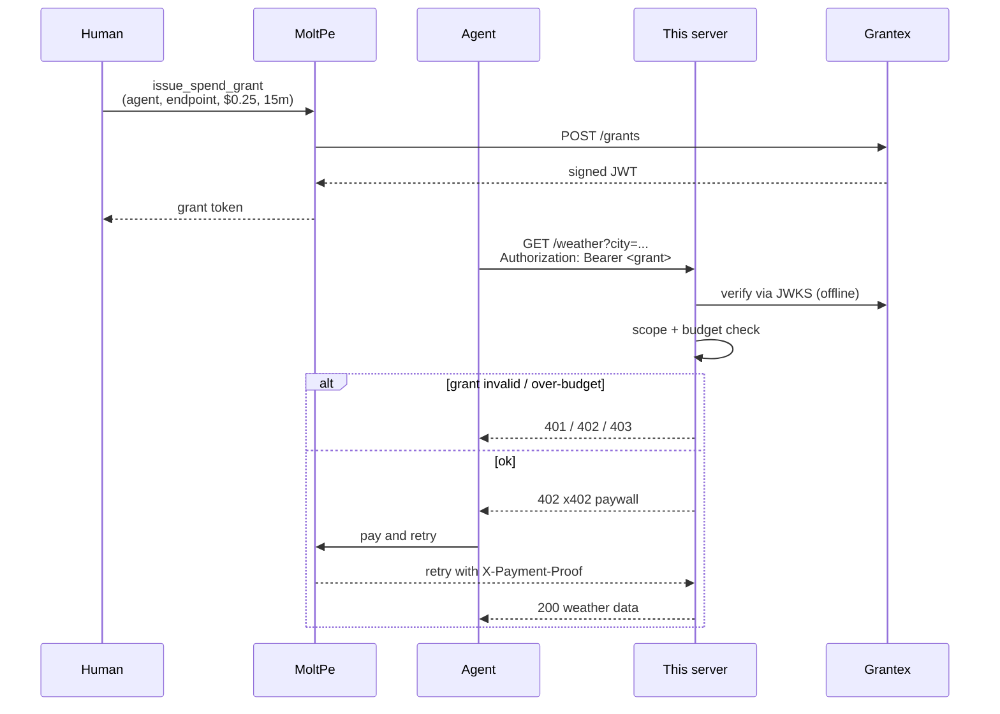

# moltpe-grantex-example

A minimal **x402 API server** that accepts calls gated by a **MoltPe** USDC payment and a **Grantex** spend grant.

If you run a paid API that AI agents call, this repo shows the shape of the request you accept: a Grantex JWT proving the human approved this spend, plus an x402 payment proof from MoltPe settling USDC on-chain. You verify the grant **first**, then the payment. If the grant is out of scope, expired, revoked, or over-budget, you reject before a single cent moves.

## Why two checks, not one?

| Check | Protects against | Who signs it |
|---|---|---|
| Grantex grant | Compromised / jailbroken agents spending outside their task | The human user |
| x402 payment | Non-paying callers | The agent (via MoltPe) |

A wallet with a daily limit isn't enough. If an agent is hijacked, the attacker burns the full limit anywhere. A Grantex grant is scoped to **one endpoint, one task, one window** — the blast radius of a compromised agent is its current grant only.

## Run it

```bash
cp .env.example .env    # fill in GRANTEX_JWKS_URI + MOLTPE_AGENT_ADDRESS
npm install
npm start               # listens on :4402
```

Smoke test (with a mock grant — replace `DEMO_GRANT_TOKEN` with a real one from MoltPe):

```bash
DEMO_GRANT_TOKEN=<real-jwt> npm run test:call
```

## The flow



## What this repo is (and isn't)

- ✅ Minimal Express middleware showing the verification order
- ✅ Works with any Grantex issuer — just set `GRANTEX_JWKS_URI`
- ❌ Not a MoltPe client — that lives in the [MoltPe](https://github.com/umangbuilds/MoltPe) repo behind the `issue_spend_grant` MCP tool
- ❌ Not a production x402 server — swap the stub in `x402Paywall` for a real facilitator call

## Files

- [src/server.ts](src/server.ts) — Express app, two-middleware stack
- [src/test-call.ts](src/test-call.ts) — smoke test

## Learn more

- [MoltPe](https://moltpe.com) — payment infrastructure for AI agents. Free tier, no credit card.
- [The x402 protocol: complete guide](https://moltpe.com/blog/x402-protocol-complete-guide) — the HTTP-native payment standard explained end to end
- [MoltPe developer quickstart](https://moltpe.com/blog/integrate-moltpe-in-5-minutes-developer-quickstart) — ship your first payment in 5 minutes (REST, MCP, x402, Python)
- [Why developers choose MoltPe for AI agent payments](https://moltpe.com/blog/why-developers-choose-moltpe-for-ai-agent-payments) — five honest reasons, with tradeoffs
- [AI agent spending policies explained](https://moltpe.com/blog/ai-agent-spending-policies-guide) — the programmable-limits model this example enforces
- [Monetizing APIs in USDC with x402](https://moltpe.com/blog/x402-protocol-india-developers) — implementation guide for Indian developers
- [The MCP server for AI agent payments](https://moltpe.com/blog/mcp-server-for-ai-agent-payments) — Claude Desktop / Cursor / Windsurf config

For Indian builders specifically:
- [AI Agent Payments in India: Complete Guide (2026)](https://moltpe.com/india)
- [Cost of AI Agent Payments in India: 2026 Benchmark](https://moltpe.com/blog/cost-of-ai-agent-payments-india-2026-benchmark)

MIT.
